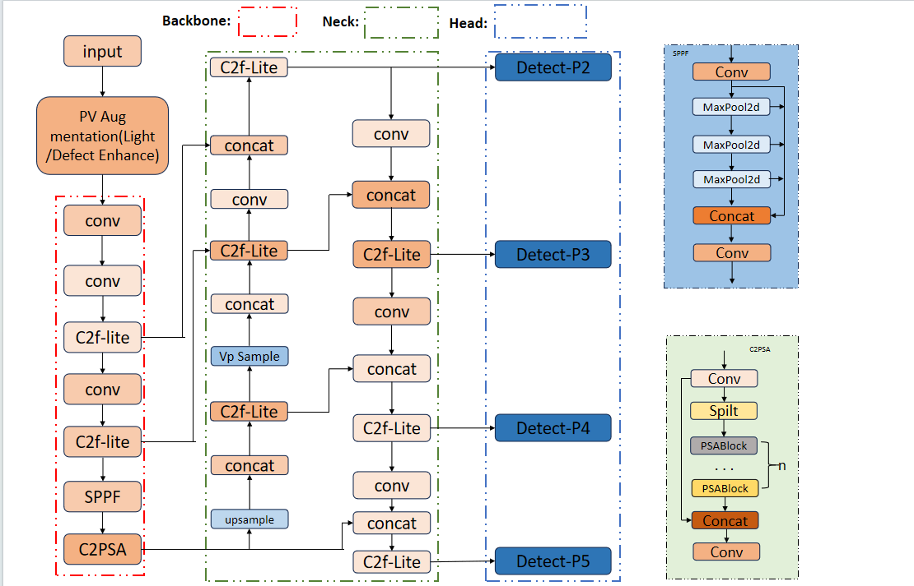

# Y-S:A Model for Solar Panel Health Monitoring

This project is built on the YOLOv11 framework and proposes a lightweight enhanced model tailored for small-defect detection on photovoltaic (PV) panels. Our research addresses the critical challenges of missed detections, heavy model size, and poor real-time performance in complex outdoor PV scenarios, with key contributions focused on the following three aspects:
- Lightweight Feature Fusion A customized C2f-Lite module is integrated into the Backbone of the model. By adopting depthwise separable convolution and a high channel compression ratio, it reduces the number of parameters by 18.9% while retaining the ability to extract weak features of small defects (e.g., bird droppings and tiny cracks), achieving a balance between model lightweight design and feature extraction capability.
- Small-Object Detection Enhancement A high-resolution detection branch is added to the Neck, combined with K-means anchor box clustering optimization for PV-specific small defects. In addition, a PV-oriented data augmentation strategy is constructed to alleviate the scarcity of small-defect samples and outdoor environmental interference, significantly improving the detection accuracy of low-pixel-occupancy targets.
- PV-Specific Module Optimization A dedicated feature refinement pipeline is designed for the Head of the model, matching the characteristics of PV panel defect distribution. The optimized detection head resolves the misalignment between classification and localization tasks in PV defect detection, and the overall framework is tailored for edge device deployment, with inference speed improved by 7.95% to meet real-time inspection requirements.


The model can identify seven classes:
~~~
bird_drop, bird_feather, cracked, dust_partical, healthy, leaf, snow
~~~

## Project Structure
~~~
your_project/
├── picture/
│   └── structure.png         <-- picture referenced in this README
├── weights/
│   └── yolo_nano_solar_panel.pt  <-- YOLOv11n-Solar pretrained weights
├── dataset/
│   └── data.yaml               <-- Example dataset YAML (modify as needed)
├──custom_yolov11.py            <-- Script for the improved model
├── training.py                 <-- Script for training the model
├── image_test.py               <-- Script for inference on a single image
├── webcam.py                   <-- Script for live webcam detection
├── requirements.txt            <-- Project dependencies
└── README.md                   <-- This file
~~~


## Dataset
We use the [Solar_Panels_Condition](https://huggingface.co/datasets/Louisnguyen/Solar_Panels_Condition/tree/main) dataset by Louisnguyen. It contains bounding-box annotations for 7 classes.

- **Training Set**: ~11,209 bounding boxes.
- **Validation Set**: ~2,899 bounding boxes.

**Download the dataset** and place it in the `dataset/` folder (or update the `data.yaml` file to point to where you store the data).

---

## Training
1. **Configure** `data.yaml` in the `dataset/` folder (or your chosen path) to match your dataset structure.
2. **Place** the YOLOv11n weights (if you have them) in `./weights/yolo_nano_solar_panel.pt`.
3.  To **train** the model, run this command:
   ```bash
   python training.py
   ```
## Evaluation
To evaluate the model on your validation set, you can **run**:

```bash
python image_test.py
```

## Running Inference
### 1. Single-Image Inference

- **Set** the `image_path` in `image_test.py` to your desired image.
- **Run**:
  ```bash
  python image_test.py
  ```

### 2. Real-Time Webcam Inference

- Connect a webcam or use your laptop’s camera.
- Run:
  ```bash
  python webcam.py
  ```
- **Press ‘q’** to quit, or **‘s’** to save a screenshot.
---
